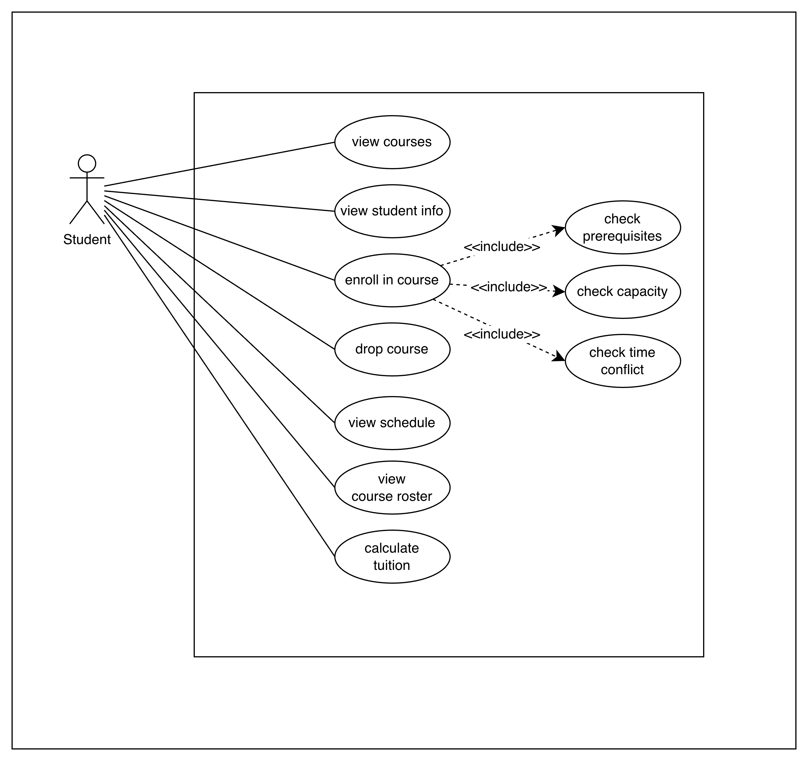
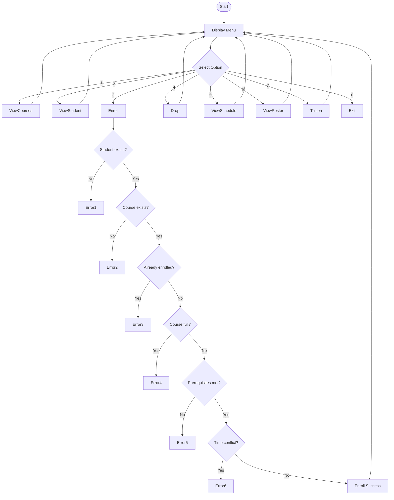

# unknownapp
This is an unknown application written in Java

---- For Submission (you must fill in the information below) ----
### Use Case Diagram


### Flowchart of the main workflow


### Prompts
for python code
```
You are a senior software developer.

Convert the course enrollment logic from Java into Python.

Requirements:
- preserve the original logic exactly
- include:
  - prerequisite checking
  - capacity validation
  - time conflict detection
- use clean and readable Python code
- avoid adding new features not present in the original code

Output only the Python function.
```